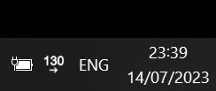
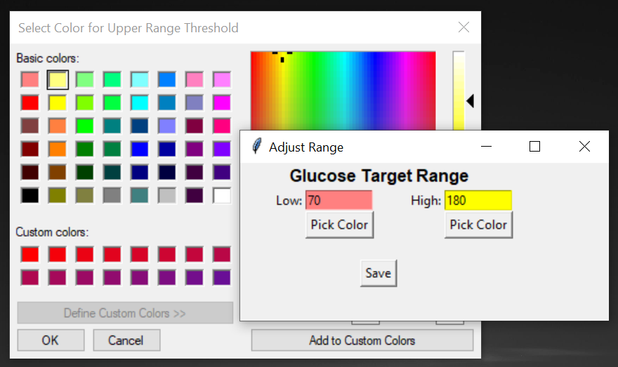
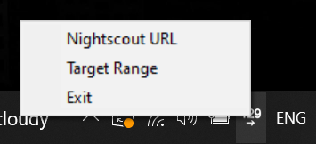

# Nightscout for Windows

Show blood sugar and trend arrow (pulled from Nightscout) as icon in the windows system tray.
CGMIcon is a customizable Windows system tray application that provides real-time monitoring of your blood glucose levels from Nightscout. With a sleek interface, it helps you stay informed about your glucose levels without the need to constantly check your phone.

## Features

- Real-time display of blood glucose levels and trend arrow
- Customizable target range thresholds with color indicators
- Automatic updates at regular intervals
- Interactive system tray menu for easy access to settings
- Support for multiple Nightscout URLs

## Screenshots

_See your current blood glucose level at a glance in the system tray._

_Adjust the target range thresholds and colors to suit your preferences._

_Easily access settings and Nightscout URLs from the system tray menu._

## Installation

1. Download the latest release of Nightscout4Windows from the [Releases](https://github.com/scimone/cgmicon/releases) page.
2. Extract the downloaded ZIP file to a desired location on your computer.
3. Run `CGMIcon.exe` to start the application.

## Usage

1. Upon launching the program, the icon will appear in your system tray.
3. Enter your Nightscout URL of the shape `https://your-nightscout_name.herokuapp.com/` into the prompt window and click "OK".
4. Right-click on the icon to access the system tray menu and adjust settings.
5. In the settings menu, you can configure the target range thresholds and colors as desired.
6. Enjoy real-time blood glucose monitoring directly from your system tray!

## Contributing

Contributions are welcome! If you encounter any issues or have suggestions for improvements, please open an issue or submit a pull request on the [GitHub repository](https://github.com/scimone/cgmicon).

## License

CGMIcon is released under the [MIT License](LICENSE).

---

If you have any questions or need assistance, please don't hesitate to reach out.
Happy monitoring!

